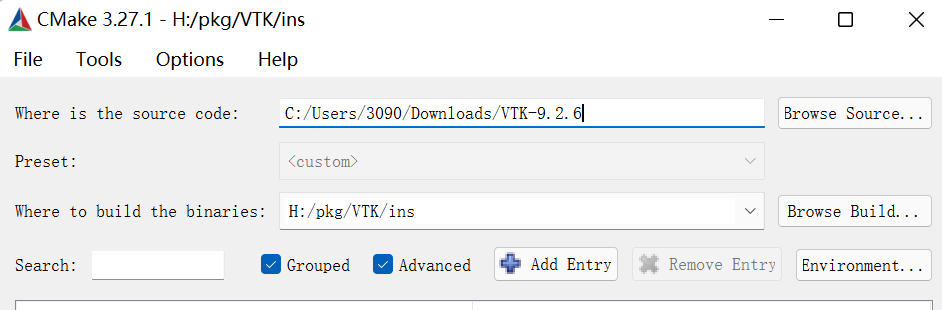
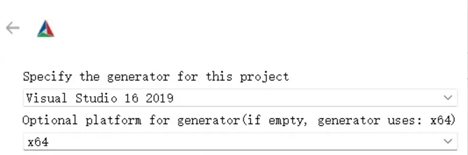
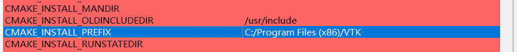
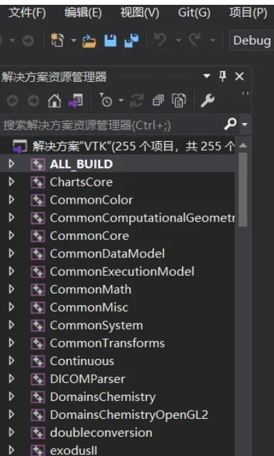
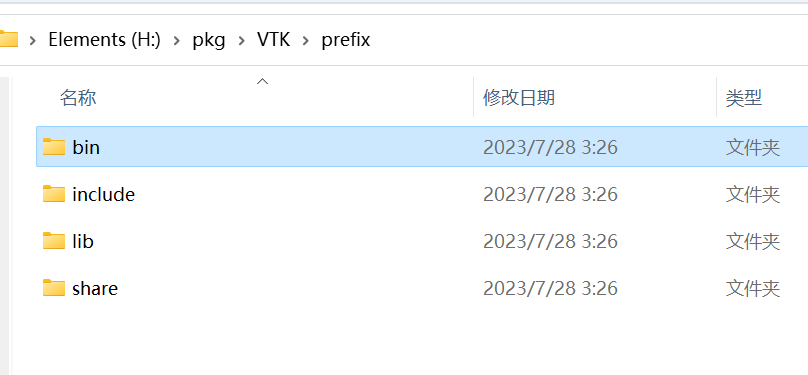
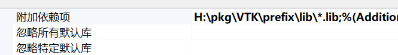
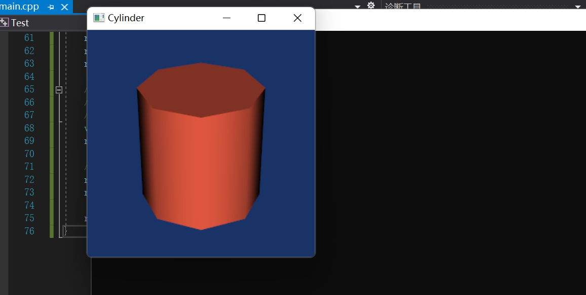

> ### This note is designed to document how to configure the vtk environment on a new machine


 

**TODO LIST**

- [ ] 1. 下载vtk (VTK-9.2.6.tar.gz)
-  sir,this way: https://vtk.org/download/ 
- [ ] 2. 解压tar.gz文件 （win系统中解压命令：tar -zxvf [filename] -C [path 2 extraction location]
- [ ] 3.进入cmake选择源码位置,build位置; (事先创建好两个文件夹install&prefix)

  >  
- [ ] 4. 点击configure选择生成器vs

  > 
- [ ] 5. 选择需要的组件，如build example可以不选,勾选QT etc(需要先安装好qt,git配置好环境变量);修改CMAKE_INSTALL_PREFIX路径为之前创建好的文件夹路径
  > 

- [ ] 6. 点击configure，如果有红色选项，需要检查提示信息；如QT6_DIR path not found
  > 则需要找到并指定qt路径再点击Configure，解决弹出的错误信息直至没有红色；

- [ ] 7.点击Generate完成运行后Open project；
  > 右键点击ALL_BUILD生成；没有失败则点INSTALL生成；(切换Debug为Release可生成对应的库)

- [ ] 8. prefix目录下得到四个文件夹
  > 将bin文件夹路径添加至环境变量；(放置dll文件)


### 运行测试代码

- 新建项目->创建main.cpp->项目->属性->vc++目录

> 包含目录(头文件所在目录)：*\VTK\prefix\include\vtk-9.2 (对应错误找不到头文件)
> 库目录(lib文件所在目录)：*\VTK\prefix\lib (对应错误使用msvc时无法解析的外部命令,还有一种情况平台没有选对x64/x86;release/debug)
> 链接器->输入->附加依赖项->新增库目录\*.lib;

> 包含文件夹下所有后缀为.lib的文件

*复制以下代码并运行：*
```cpp
//在每个例子下面需要添加，这一段宏阻塞，否则加载不出图像
#include <vtkAutoInit.h>
VTK_MODULE_INIT(vtkRenderingOpenGL2);
VTK_MODULE_INIT(vtkInteractionStyle); ///
VTK_MODULE_INIT(vtkRenderingVolumeOpenGL2);
#include <vtkActor.h>
#include <vtkCamera.h>
#include <vtkCylinderSource.h>
#include <vtkNamedColors.h>
#include <vtkNew.h>
#include <vtkPolyDataMapper.h>
#include <vtkProperty.h>
#include <vtkRenderWindow.h>
#include <vtkRenderWindowInteractor.h>
#include <vtkRenderer.h>

#include <array>

int main(int, char* [])
{
    vtkNew<vtkNamedColors> colors;
    // Set the background color.
    std::array<unsigned char, 4> bkg{ {26, 51, 102, 255} };
    colors->SetColor("BkgColor", bkg.data());

    // This creates a polygonal cylinder model with eight circumferential facets
    vtkNew<vtkCylinderSource> cylinder;
    cylinder->SetResolution(8);

    vtkNew<vtkPolyDataMapper> cylinderMapper;
    cylinderMapper->SetInputConnection(cylinder->GetOutputPort());

    vtkNew<vtkActor> cylinderActor;
    cylinderActor->SetMapper(cylinderMapper);

    vtkNew<vtkRenderer> renderer;
    renderer->AddActor(cylinderActor);

    // The render window is the actual GUI window
    // that appears on the computer screen
    vtkNew<vtkRenderWindow> renderWindow;
    renderWindow->AddRenderer(renderer);
    renderWindow->SetWindowName("Cylinder");

    // The render window interactor captures mouse events
    // and will perform appropriate camera or actor manipulation
    // depending on the nature of the events.
    vtkNew<vtkRenderWindowInteractor> renderWindowInteractor;
    renderWindowInteractor->SetRenderWindow(renderWindow);

    // This starts the event loop and as a side effect causes an initial render.
    renderWindow->Render();
    renderWindowInteractor->Start();

    return EXIT_SUCCESS;
}
```

如果配置没有问题会出现以下结果：

---
若有任何问题或建议